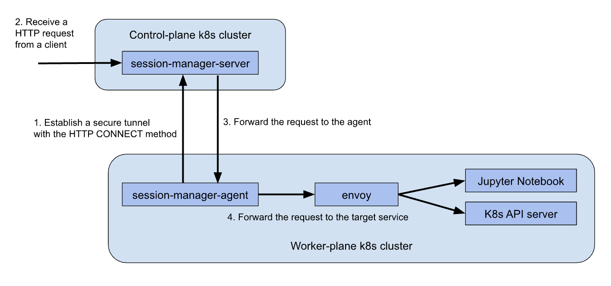

# session-manager
Session Manager provides a secure session between a control-plane cluster and worker-plane clusters. It is only useful in a multi-cluster setup where the control-plane and the worker-plane run separately.

The established secure sessions are used for multiple purposes. For example, a end user can access a Jupyter Notebook running in a worker cluster via a secure session.
Secure sessions are also used to build a federated k8s cluster.

One unique feature of this secure session is that we don't need to
open any incoming port in a worker-plane cluster.  A worker-plane
cluster can be in a private network that is not accessible from
outside. `session-manager-agent` initializes an outgoing connection to
`session-manager-server` to establish the session.

  

